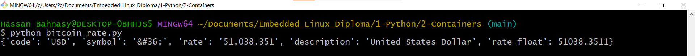

# Python Scripts Documentation

## Overview

This repository contains several Python scripts demonstrating different functionalities. Below are descriptions and usage instructions for each script.

## Scripts

### **add_shortcut.py**

This script listens for a keyboard shortcut (Ctrl + Alt + S) and opens a specific folder when the shortcut is triggered.

#### Usage

1. **Install Dependencies**: Ensure you have the `keyboard` library installed. You can install it using:
   - `pip install keyboard`
2. **Run the Script**: Execute the script with Python. Press Ctrl + Alt + S to open the specified folder.

#### Example Code

```python
import keyboard
import subprocess

def on_triggered():
    print("triggered")
    # 'explorer' for Windows
    # 'nautilus' for Linux
    subprocess.run(['explorer', r'C:\Users\Pc\Documents\Embedded_Linux_Diploma\1-Python\2-Containers'])

def listen_for_shortcut():
    # Set the desired shortcut key combination (Example: Ctrl + Alt + S)
    shortcut = "ctrl + alt + s"

    # Register the callback function for the shortcut
    keyboard.add_hotkey(shortcut, on_triggered)

    # Continuously listen for keyboard events
    keyboard.wait()

# Start listening for the shortcut
listen_for_shortcut()
```
---

### **add_shortcut_2.py**

This script listens for a keyboard shortcut (Ctrl + Alt + S) and writes the current date and time to a file when the shortcut is triggered.

#### Usage

1. **Install Dependencies**: Ensure you have the `keyboard` library installed. You can install it using:
   - `pip install keyboard`
2. **Run the Script**: Execute the script with Python. Press Ctrl + Alt + S to write the current date and time to `date.txt`.

#### Example Code

```python
import keyboard
import subprocess
import datetime

def on_triggered():
    print("triggered")
    file = open(r'C:\Users\Pc\Documents\Embedded_Linux_Diploma\1-Python\2-Containers\date.txt', 'w')
    file.write(str(datetime.datetime.now()))
    file.close()

def listen_for_shortcut():
    shortcut = "ctrl + alt + s"
    keyboard.add_hotkey(shortcut, on_triggered)
    keyboard.wait()

listen_for_shortcut()
```

---

### **bitcoin_rate.py**

This script fetches and prints the current Bitcoin price in USD from the CoinDesk API.

#### Usage

1. **Install Dependencies**: Ensure you have the `requests` library installed. You can install it using:
   - `pip install requests`
2. **Run the Script**: Execute the script with Python. It will print the current Bitcoin price in USD.

#### Example Code

```python
import requests

url = requests.get("https://api.coindesk.com/v1/bpi/currentprice.json")
print(url.json()['bpi']['USD'])
```

#### Expected Output


---

### **convert_text_to_speak.py**

This script converts a given text into speech using the `gTTS` (Google Text-to-Speech) library and plays the audio using the `python-vlc` library. It saves the audio file as `Test.mp3` and then plays it.

#### Usage

1. **Install Dependencies**: Ensure you have the `gtts` and `python-vlc` libraries installed. You can install them using:
   - `pip install gtts`
   - `pip install python-vlc`
2. **Run the Script**: Execute the script with Python. It will convert the text to speech, save it as `Test.mp3`, and play the audio.

#### Example Code

```python
from gtts import gTTS
import vlc

# Convert the text to speech
myobj = gTTS(text='My name is Hassan Bahnasy I LOVE ZAMALEK', lang='en', slow=False)

# Save the converted audio to an MP3 file
myobj.save("Test.mp3")

# Play the converted audio file
p = vlc.MediaPlayer("./Test.mp3")
p.play()

# Keep the script running to allow the audio to play
while True:
    pass
```

---

### **FavFolder.py**

This script allows the user to select a folder from a predefined list of favorite folders and then opens the selected folder using the default file manager. It handles both Windows and Linux systems.

#### Usage

1. **Run the Script**: Execute the script with Python. It will display a list of predefined favorite folders.
2. **Select a Folder**: Enter the index of the folder you want to open. The script will open the selected folder using the default file manager.

#### Example Code

```python
import os
import subprocess

# List of favorite folders
favorite_folders = [
    "E:/Self_Learning",
    "E:/asu",
    "E:/Self_Learning/Embedded IMT"
]

# Display available folders to the user
for i, folder in enumerate(favorite_folders):
    print(f"{i}: {folder}")

try:
    val = int(input("Please select your directory (index starts with 0): "))
    if val < 0 or val >= len(favorite_folders):
        raise ValueError("Invalid index")
except ValueError:
    print("Invalid input. Please enter a valid index.")
else:
    # Open the selected folder using the default file manager
    folder_path = favorite_folders[val]
    if os.name == 'nt':
        os.startfile(folder_path)
    elif os.name == 'posix':
        subprocess.run(["xdg-open", folder_path])
    else:
        print("Unsupported operating system.")
```

---

### **find_largest_num.py**

This script defines a function to find the largest number in a given list using a loop. It then uses this function to find and print the largest number from a predefined list.

#### Usage

1. **Run the Script**: Execute the script with Python. It will print the largest number in the predefined list.

#### Example Code

```python
def find_largest_num(input_list):
    # Check if the list is empty
    if not input_list:
        return None  # Return None if the list is empty
    
    # Initialize the maximum value with the first item of the list
    max_num = input_list[0]

    # Iterate through the list starting from the second item
    for num in input_list[1:]:
        # Compare each item with the current maximum value
        if num > max_num:
            max_num = num  # Update the maximum value if a larger item is found

    return max_num  # Return the maximum value

# Define a list of numbers
my_list = [10, 5, 20, 8, 15]

# Find the largest number in the list
largest_number = find_largest_num(my_list)

# Print the result
print("The largest number in the list is:", largest_number)
```

---

### **TimeNow.py**

This script retrieves the current date and time, formats it, and prints it. It excludes the last 7 characters from the default string representation of the date and time, which typically removes microseconds.

#### Usage

1. **Run the Script**: Execute the script with Python. It will print the current date and time, excluding the last 7 characters.

#### Example Code

```python
import datetime

# Get the current date and time
now = datetime.datetime.now()

# Print the current date and time
print("Current date and time: ")

# Format and print the date and time, removing the last 7 characters
# (usually to exclude microseconds)
print(str(now)[0:-7])
```

---

### **Youtube_Downloader.py**

This script downloads a YouTube video using the `pytube` library. It selects the first available progressive MP4 stream (which includes both video and audio) and downloads it.

#### Usage

1. **Install Dependencies**: Ensure you have the `pytube` library installed. You can install it using:
   - `pip install pytube`
2. **Run the Script**: Execute the script with Python. It will download the video from the specified URL.

#### Example Code

```python
from pytube import YouTube

# URL of the YouTube video to download
video_url = "https://youtu.be/GxDZR8A3QPM?si=vvh7SjZao8u-KMS8"

# Create a YouTube object using the video URL
yt = YouTube(video_url)

# Filter the streams to get only progressive (video + audio) MP4 files
# and select the first available stream
stream = yt.streams.filter(progressive=True, file_extension='mp4').first()

# Download the selected stream
stream.download()
```

---

Let me know if you need any further modifications or additional scripts to be integrated!