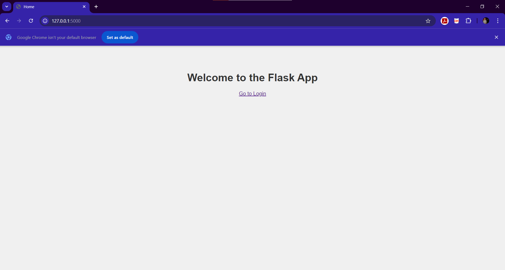
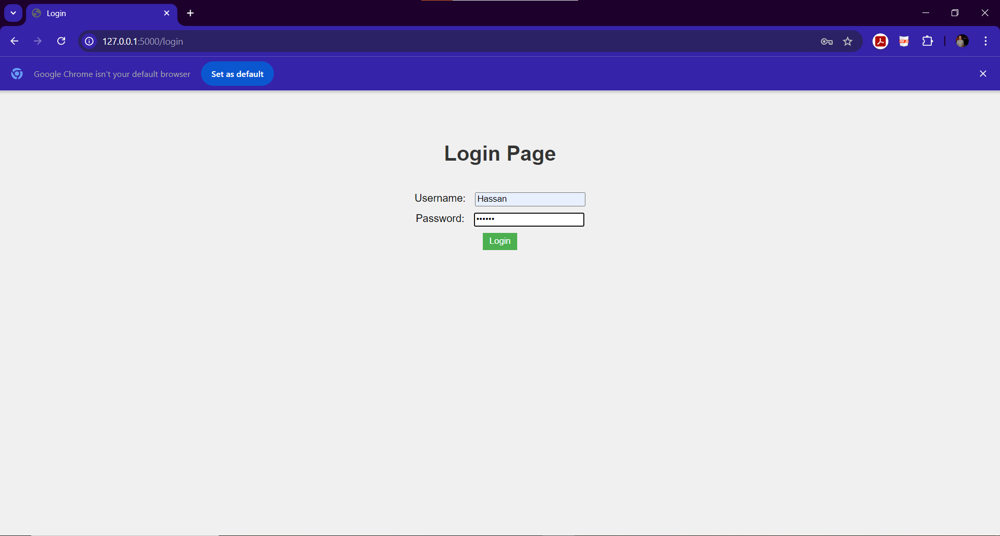
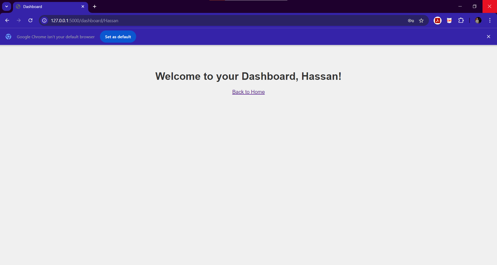
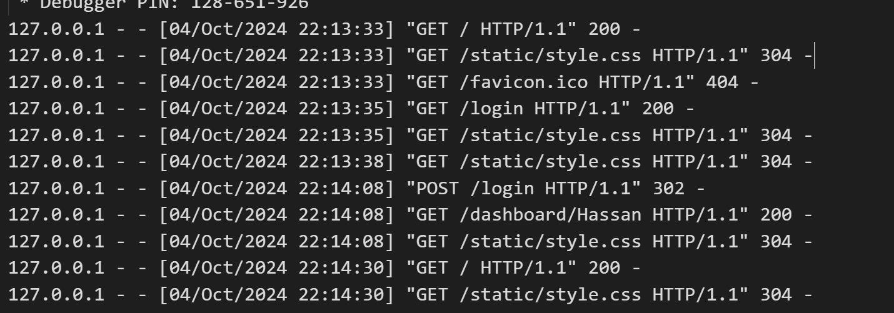

# 📦 Flask Login Dashboard Example  

This is a simple Flask web application demonstrating routing, handling POST requests for a login form, and rendering dynamic HTML using Jinja2 templates. The application allows users to log in with predefined credentials and view a personalized dashboard.  

---

## ✨ Features  

- 🌐 **Multiple URL Routing**: Navigate seamlessly between pages.  
- 🔑 **Login Form Handling**: Securely process POST requests for user login.  
- 🖋️ **Dynamic HTML Rendering**: Personalized dashboard using Jinja2 templates.  
- 🛡️ **Basic User Authentication**: Validate credentials with a simple dictionary-based user store.  

---

## 📁 Directory Structure  

```
my_flask_app/
│
├── 🐍 app.py                  # Main Flask application
├── 📂 templates/
│   ├── 🖥️ index.html           # Home page template
│   ├── 🔑 login.html           # Login page template
│   └── 📊 dashboard.html       # Dashboard page template
└── 📂 static/
    └── 🎨 style.css            # Basic CSS for styling
```  

---

## 🛠️ Setup Instructions  

### ✅ Prerequisites  

- 🐍 Python 3.x  
- 📦 Flask (`pip install Flask`)  

### ▶️ How to Run the Application  

1. **Clone the Repository** or create the directory structure as shown.  
2. Navigate to the project directory:  

    ```bash
    cd my_flask_app
    ```  

3. **Install Flask**:  

    ```bash
    pip install Flask
    ```  

4. **Run the Flask Application**:  

    ```bash
    python app.py
    ```  

5. Open your browser and go to `http://127.0.0.1:5000/` to view the home page.  

---

## 🔐 Predefined User Credentials  

| **Username**  | **Password**  |  
|---------------|---------------|  
| Hassan        | Hassan        |  
| Bahnasy       | Bahnasy       |  

> You can modify these credentials in the `users` dictionary in `app.py`.  

---

## 📸 Screenshots  

1. **🏠 Home Page**:  
   A welcome message and a link to the login page.  
     

2. **🔑 Login Page**:  
   A form for entering username and password with error handling.  
     

3. **📊 Dashboard**:  
   A personalized greeting with the username after successful login.  
     

4. **🔄 Handling Requests**:  
   Illustration of HTTP request handling.  
     

---

## 🗂️ File Descriptions  

### 🐍 `app.py`  
- The main Flask application file.  
- Handles routing for:  
  - `/`: Home page  
  - `/login`: Login page  
  - `/dashboard/<username>`: User dashboard  
- Processes POST requests for login and validates credentials.  

### 🖥️ `templates/`  
- HTML templates for the home, login, and dashboard pages.  
- Uses **Jinja2** templating for dynamic content.  

### 🎨 `static/style.css`  
- Adds basic styling for the application.  

---

## ⚙️ How It Works  

1. **Visit** the Home Page (`/`) and navigate to the Login Page.  
2. **Submit** username and password on the Login Page (`/login`).  
3. **Validation**:  
   - If credentials are valid, the user is redirected to the Dashboard.  
   - Otherwise, an error message is displayed.  
4. **Dashboard**: A personalized page displays a greeting with the username.  

---

## ✏️ Customization  

- To add more users, modify the `users` dictionary in `app.py`.  
- Enhance the styling by updating `static/style.css`.  

