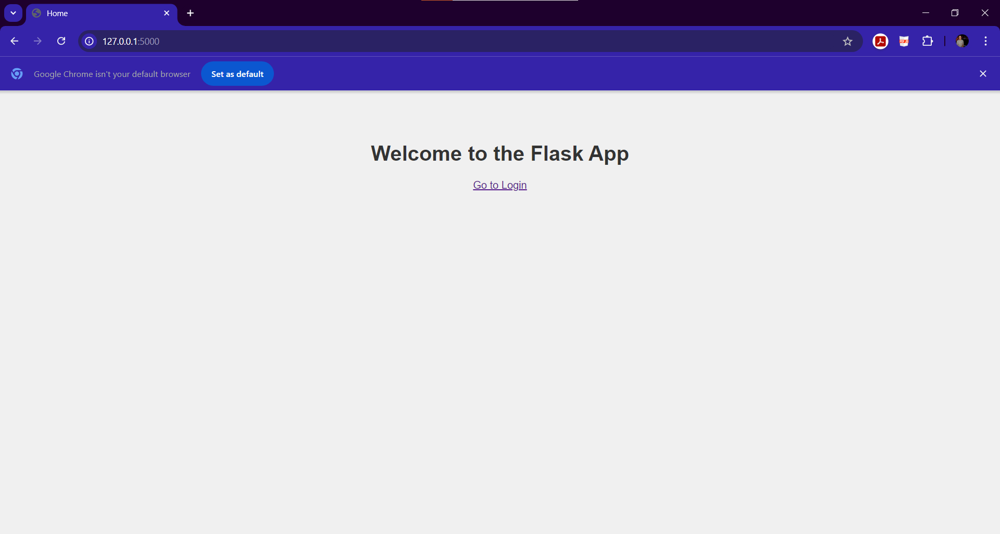
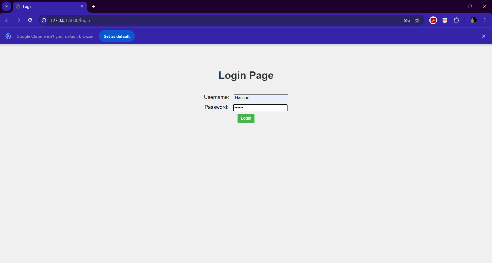
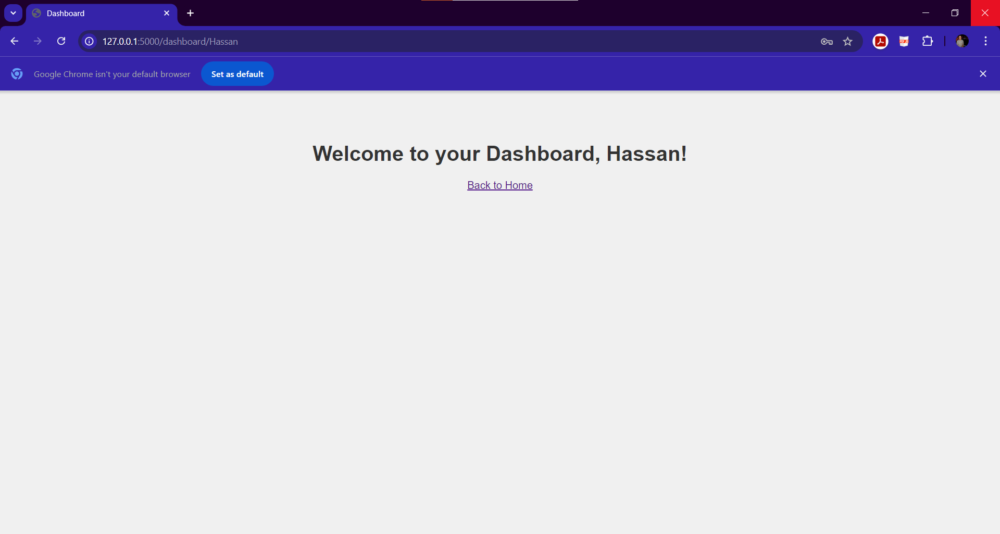
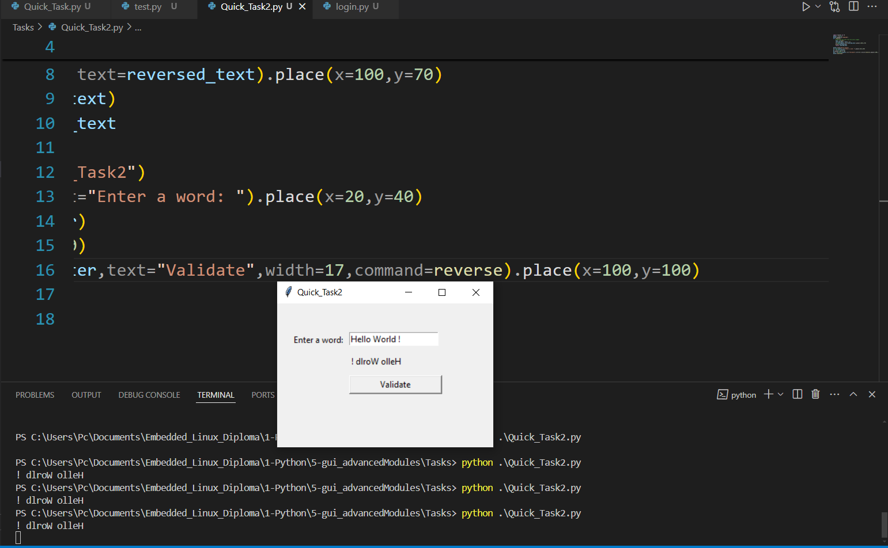

# 🐍 Python GUI and Advanced Modules  
 
  


This repository contains various projects and tasks completed during the Embedded Linux Diploma, focusing on Python GUI development, advanced modules, Flask web applications, and socket programming.

---

## 📁 Folder Structure  

```
.
│   📷 image.png
│   📄 README.md
│
├───📂 Labs
│   │   🐍 opencv.py
│   │
│   ├───📂 GUI
│   │       🐍 login.py
│   │       🐍 paint.py
│   │       🐍 test.py
│   │
│   ├───📂 my_flask_app
│   │   │   🐍 app.py
│   │   │   📷 Dashboard.png
│   │   │   📷 Home.png
│   │   │   📷 Login.png
│   │   │   📄 README.md
│   │   │   📷 Requests.png
│   │   │
│   │   ├───📂 static
│   │   │       🎨 style.css
│   │   │
│   │   └───📂 templates
│   │           🖥️ dashboard.html
│   │           🖥️ index.html
│   │           🖥️ login.html
│   │
│   └───📂 Socket_Programming
│           🐍 client.py
│           📷 image.png
│           🐍 server.py
│           📷 Socket_Programming.png
│
└───📂 Tasks
        📷 Quick_Task.png
        🐍 Quick_Task.py
        📷 Quick_Task2.png
        🐍 Quick_Task2.py
        📷 Quick_Task3.png
        🐍 Quick_Task3.py
        📷 Task_Four.png
        🐍 Task_Four_client.py
        🐍 Task_Four_server.py
        📷 Task_One.png
        🐍 Task_One.py
        📷 Task_Three.png
        🐍 Task_Three.py
        📷 Task_Two.png
        🐍 Task_Two.py
```

---

## 🔬 Labs Scripts  

### 1. 📡 Socket Programming  

This folder contains Python scripts demonstrating basic socket programming. It includes two main files:  

- **`server.py`**: A simple TCP server that listens for incoming connections and exchanges messages with clients.  
- **`client.py`**: A simple TCP client that connects to the server, sends a message, and receives a response.  

  

---

## 📝 File Descriptions  

### 🖥️ `server.py`  

This script sets up a TCP server that:  
- Binds to the local IP address and port `5000`.  
- Listens for incoming connections.  
- Receives messages from connected clients.  
- Sends a user-input message back to the client.  

**🔧 Usage:**  
1. Run `server.py` to start the server.  
2. The server will print its IP address and wait for a client connection.  
3. When a client connects, it will display the received message and prompt for a response.  

---

### 🖥️ `client.py`  

This script sets up a TCP client that:  
-  Connects to the server using the local IP address and port `5000`.  
-  Sends a user-input message to the server.  
-  Receives and prints a message from the server.  

**🔧 Usage:**  
1. Ensure `server.py` is running before executing `client.py`.  
2. Run `client.py` to start the client.  
3. Enter a message to send to the server and view the server's response.  

---

#### 🛠️ Requirements  

- 🟢 **Python 3.x**  

---

#### 🚀 How to Run  

1. 🔸 Open two terminal windows.  
2. 🔸 In the first terminal, navigate to the directory containing `server.py` and run:  
    ```bash
    python server.py
    ```  
3. 🔸 In the second terminal, navigate to the directory containing `client.py` and run:  
    ```bash
    python client.py
    ```  
4. 🔸 Follow the prompts in each terminal to send and receive messages.  

---

#### ⚠️ Notes  

- 🔷 Both scripts use the local IP address for communication. Make sure the server is running before starting the client.  
- 🔷 The default port used is `5000`. Modify the port number in the scripts if needed.  

---

### 2. 🖌️ GUI Scripts  

This folder contains Python scripts demonstrating GUI programming using the `tkinter` module. These scripts showcase various GUI applications, including login forms, drawing applications, and exploratory GUI functionalities.

---

### 1. **`login.py`** ✏️🔑  
A simple GUI-based login form that accepts user input for first and last names and prints a welcome message.

#### 🛠️ Features:
- 🖥️ Displays fields for entering the first name and last name.
- 🎉 Prints the entered names to the console when the "Login" button is clicked.

#### ⚙️ **Requirements**:
- 🐍 Python 3.x
- 📦 `tkinter` (pre-installed with Python on most systems)

#### ▶️ **How to Run**:
1. Open a terminal or command prompt.
2. Navigate to the directory containing `login.py`.
3. Run the script using the command:
   ```bash
   python login.py
   ```
4. 📝 Enter your first and last name in the input fields, then click "Login" to see the message in the console.

#### 📝 **Notes**:
- ✅ Ensure `tkinter` is installed and supported on your Python environment.
- 🖼️ The GUI window size is fixed, but it can be modified in the script as needed.

---

### 2. **`paint.py`** 🎨🖌️  
A basic drawing application where users can draw by dragging the mouse.

#### 🛠️ Features:
- ✍️ Users can draw freehand on the canvas by holding and dragging the mouse.
- 🟩 The canvas responds to mouse movements and draws small lines in green color.

#### ⚙️ **Requirements**:
- 🐍 Python 3.x
- 📦 `tkinter` (pre-installed with Python on most systems)

#### ▶️ **How to Run**:
1. Open a terminal or command prompt.
2. Navigate to the directory containing `paint.py`.
3. Run the script using the command:
   ```bash
   python paint.py
   ```
4. 🖌️ Use your mouse to draw on the canvas by holding the left mouse button and dragging.

#### 📝 **Notes**:
- 🎨 The drawing color and brush size are defined in the script and can be customized.
- 🖼️ The default canvas size is 400x250, but it can be adjusted in the code.

---

### 3. **`test.py`** 🧪🔬  
A collection of experiments with the `tkinter` library, showcasing various GUI features and components.

#### 🛠️ Features:
- 🚀 Demonstrates various `tkinter` functionalities, such as:
  - 📝 Creating main windows with titles, sizes, and configurations.
  - 🛠️ Using widgets like labels, buttons, radiobuttons, checkbuttons, and more.
  - 🎛️ Handling user inputs and events.
  - 🎨 Drawing shapes on a canvas.

#### ⚙️ **Requirements**:
- 🐍 Python 3.x
- 📦 `tkinter` (pre-installed with Python on most systems)

#### ▶️ **How to Run**:
1. Open the script `test.py` in a text editor.
2. 🔧 Uncomment the desired section of the script corresponding to the functionality you want to test.
3. Save the script and run it using:
   ```bash
   python test.py
   ```

#### 📝 **Notes**:
- 🧩 Each section in the script is independent and demonstrates a specific feature.
- 📚 The examples are progressively more complex, making this script a great learning resource for `tkinter`.

---

### 3. 🌐 Flask Application: my_flask_app

#### 📄 Description

A simple Flask web application demonstrating:

- 🌐 Dynamic HTML rendering with Jinja2
- 🔒 Login functionality with predefined user credentials
- 📜 Routing and HTTP POST request handling
- 🎨 Customizable templates and styles

---

#### 📂 Directory Structure

```
my_flask_app/
│
├── app.py                  # Main Flask application
├── templates/
│   ├── index.html           # Home page template
│   ├── login.html           # Login page template
│   └── dashboard.html       # Dashboard page template
└── static/
    └── style.css            # Basic CSS for styling
```

---

#### 🚀 Setup Instructions

1. **Clone the repository** or create the directory structure shown above.
2. Navigate to the project directory:

   ```bash
   cd Labs/my_flask_app
   ```

3. **Install Flask** if it's not already installed:

   ```bash
   pip install Flask
   ```

4. **Run the Flask application**:

   ```bash
   python app.py
   ```

5. Open your browser and go to `http://127.0.0.1:5000/` to view the home page.

---

#### 📜 Predefined User Credentials

The application uses a dictionary to store user credentials. These are the current users:

- **Username**: Hassan, **Password**: Hassan
- **Username**: Bahnasy, **Password**: Bahnasy

You can modify these credentials by editing the `users` dictionary in `app.py`.

---

#### 📸 Screenshots

1. **Home Page**  
   

2. **Login Page**  
   

3. **Dashboard**  
   

4. **Requests**  
   

---

#### 🔍 How It Works

1. Users visit the **Home Page** (`/`) and click the login link.
2. On the **Login Page** (`/login`), users submit their username and password.
3. Flask processes the login form and checks if the credentials match the predefined users in the `users` dictionary.
4. If valid, users are redirected to their **Dashboard** (`/dashboard/<username>`), where they are greeted by name.
5. Invalid credentials display an error message on the login page.

---

#### ✏️ Customization

- To add more users, modify the `users` dictionary in `app.py`.
- You can style the application further by editing `static/style.css`.

---

### 4. **`opencv.py`** 📸🎥 

This script demonstrates how to capture and display video frames from a webcam using the `OpenCV` library. It also includes functionality for capturing images.

#### 🛠️ Features:
- 📹 Opens the default camera and streams the video in real-time.
- 🖼️ Displays the video feed in a window named "Camera Preview."
- 📸 Captures and saves a frame as an image when the `c` key is pressed.
- ❌ Ends the video stream when the `q` key is pressed.

#### ⚙️ **Requirements**:
- 🐍 Python 3.x
- 📦 OpenCV library (`opencv-python`)

#### ▶️ **How to Run**:
1. Install the required library using pip:
   ```bash
   pip install opencv-python
   ```
2. Run the script using:
   ```bash
   python opencv.py
   ```
3. Use the following controls:
   - Press `c` to capture an image and save it as `captured_image.jpg`.
   - Press `q` to quit the application.

#### 📝 **Notes**:
- Ensure a webcam is connected and accessible by your system.
- Images are saved in the same directory as the script.

---

## Tasks Scripts 😊

This Folder contains Python scripts utilizing Tkinter and socket programming to create a variety of tasks. Each task is explained below with a corresponding script and visualization.

### Task 1: Quick Task 📝

**Description**: This script demonstrates creating a grid layout with four buttons in a simple Tkinter GUI.

**Key Features**:
- Four buttons arranged in a grid layout.
- No additional logic, focuses on layout management.

**Code**: [Quick_Task.py](./Tasks/Quick_Task.py)

**Screenshot**: 

---

### Task 2: Reverse Text Input ➡️

**Description**: This script creates a GUI to input a word and reverse it upon pressing a button.

**Key Features**:
- Input field to enter text.
- Button to trigger reversal logic.
- Display of the reversed text within the GUI.

**Code**: [Quick_Task2.py](./Tasks/Quick_Task2.py)

**Screenshot**: 

---

### Task 3: Arithmetic Operations ➕➖

**Description**: This GUI allows users to perform addition or subtraction between two numbers.

**Key Features**:
- Input fields for two numbers.
- Radiobuttons to select addition or subtraction.
- Button to validate inputs and display the result.
- Error handling for invalid input.

**Code**: [Quick_Task3.py](./Tasks/Quick_Task3.py)

**Screenshot**: 

---

### Task 4: Digital Clock with Gauge ⏰⚙️

**Description**: This script displays a real-time digital clock and a gauge visualization, styled with a gray and black theme.

**Key Features**:
- Digital clock updated every second.
- Gauge visualization with a movable needle to represent a value.
- Status indicator for Arduino RS232 communication.

**Code**: [Task_One.py](./Tasks/Task_One.py)

**Screenshot**: 

---

### Task 5: LED Control 🔦

**Description**: This GUI simulates controlling an LED with buttons to turn it ON or OFF.

**Key Features**:
- Canvas with a drawable oval to represent the LED.
- Two buttons for ON and OFF operations.
- Status label to display the LED state.

**Code**: [Task_Two.py](./Tasks/Task_Two.py)

**Screenshot**: 

---

### Task 6: Factorial Calculator 🧪

**Description**: This GUI calculates the factorial of an entered integer.

**Key Features**:
- Input field for the integer.
- Button to calculate the factorial.
- Error handling for invalid or negative inputs.

**Code**: [Task_Three.py](./Tasks/Task_Three.py)

**Screenshot**: 

---

### Task 7: Client-Server Communication 📢‍💬

**Description**: This task includes two scripts demonstrating client-server communication using sockets.

#### Server Script ♻️
- Listens for client connections.
- Handles multiple clients simultaneously.
- Sends acknowledgments for received messages.

**Code**: [Task_Four_server.py](./Tasks/Task_Four_server.py)

#### Client Script 📨
- Connects to the server.
- Sends messages to the server and displays the server's response.
- Terminates connection upon entering "exit."

**Code**: [Task_Four_client.py](./Tasks/Task_Four_client.py)

**Screenshot**: 

---

### How to Run ⚡

1. Clone the repository.
2. Navigate to the directory containing the desired script.
3. Run the script using Python 3.
4. For Task 7, start the server script first, then run the client script in a separate terminal.

### Requirements ✅

- Python 3.x
- Tkinter library (usually pre-installed with Python)

---

## Author 👤

**Hassan Ahmed Fathy, El Bahnasy**  
- [LinkedIn](https://www.linkedin.com/in/hassanbahnasy/)  
- [GitHub](https://github.com/Bahnasy2001)  
- Contact: hassanbahnasy872@gmail.com