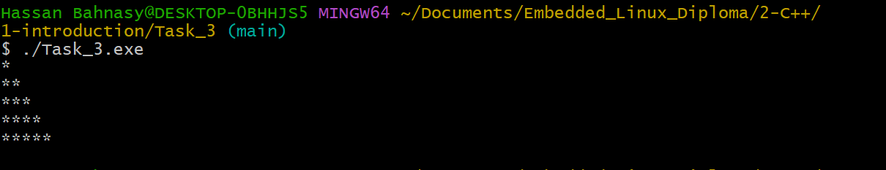

#  Introduction Tasks 

  


## Overview 🌟

This section contains introductory tasks written in C++ to demonstrate fundamental programming concepts. Each task includes a detailed description, example code, and output screenshots to aid in understanding.

---

## Tasks 📂

### 1. **ASCII Code Table** 🔤

This program generates and displays a table of ASCII characters and their corresponding codes (0 to 127).

#### Usage 🚀

1. Run the program.
2. The output will display a formatted ASCII table.

#### Example Code 📝

```cpp
#include <iostream>

int main()
{
    std::cout << "ASCII Code Table:" << std::endl;
    std::cout << "+------+-------+" << std::endl;
    std::cout << "| Char | ASCII |" << std::endl;
    std::cout << "+------+-------+" << std::endl;
    for (int i = 0; i < 128; i++)
    {
        std::cout << "|    " << char(i) << " |" << "     " << i << "  |" << std::endl;
    }
    return 0;
}
```

#### Output Screenshot 🖼️


---

### 2. **Maximum Number Finder** 🔢

This program identifies the largest number among three user-provided integers.

#### Usage 🚀

1. Run the program.
2. Input three integers.
3. The output will display the largest integer.

#### Example Code 📝

```cpp
#include <iostream>

int main()
{
    int a, b, c;
    std::cout << "Enter first Number: ";
    std::cin >> a;
    std::cout << "Enter Second Number: ";
    std::cin >> b;
    std::cout << "Enter Third Number: ";
    std::cin >> c;
    if (a > b && a > c) {
        std::cout << "The Maximum Number is " << a << std::endl;
    } else if (b > c) {
        std::cout << "The Maximum Number is " << b << std::endl;
    } else {
        std::cout << "The Maximum Number is " << c << std::endl;
    }
    return 0;
}
```

#### Output Screenshot 🖼️


---

### 3. **Right-Angle Triangle Drawer** 📐

This program prints a right-angle triangle pattern using asterisks.

#### Usage 🚀

1. Run the program.
2. The output will display the triangle pattern.

#### Example Code 📝

```cpp
#include <iostream>

int main()
{
    for (int i = 1; i <= 5; i++)
    {
        for (int j = 0; j < i; j++)
        {
            std::cout << "*";
        }
        std::cout << "\n";
    }
    return 0;
}
```

#### Output Screenshot 🖼️



---

### 4. **Vowel Checker** 🅰️

This program determines whether a given character is a vowel.

#### Usage 🚀

1. Run the program.
2. Enter a single character.
3. The output will state whether the character is a vowel.

#### Example Code 📝

```cpp
#include <iostream>

int main()
{
    char x;
    std::cin >> x;
    switch (x) 
    {
        case 'a':
        case 'e':
        case 'i':
        case 'o':
        case 'u':
            std::cout << "The letter is vowel!" << std::endl;
            break;
        default:
            std::cout << "The letter is not vowel!" << std::endl;
    }
    return 0;
}
```

#### Output Screenshot 🖼️


---

### 5. **Multiplication Table** ✖️

This program displays the multiplication table for a user-provided integer.

#### Usage 🚀

1. Run the program.
2. Input an integer.
3. The output will display the multiplication table for the given number.

#### Example Code 📝

```cpp
#include <iostream>

int main()
{
    int x;
    std::cout << "Enter The Number To Display its Multiplication Table: ";
    std::cin >> x;
    for (int i = 1; i < 13; i++)
    {
        std::cout << x << " * " << i << " = " << x * i << std::endl;
    }
    return 0;
}
```

#### Output Screenshot 🖼️


---

### 6. **Sum of Digits** ➕

This program calculates the sum of the digits of a user-provided integer.

#### Usage 🚀

1. Run the program.
2. Input an integer.
3. The output will display the sum of its digits.

#### Example Code 📝

```cpp
#include <iostream>

int main()
{
    int num;
    int result = 0;
    std::cout << "Enter Number: ";
    std::cin >> num;
    while(num > 0)
    {
        result += num % 10;
        num /= 10;
    }
    std::cout << "\nSumming of Digits equal " << result << std::endl;
    return 0;
}
```

#### Output Screenshot 🖼️


---

### 7. **Decimal and Binary Conversion** 🔁

This program converts a decimal number to binary and a binary number to decimal.

#### Usage 🚀

1. Run the program.
2. Input a decimal number to see its binary representation.
3. Input a binary number to see its decimal equivalent.

#### Example Code 📝

```cpp
#include <iostream>
#include <bitset>

int main()
{
    int dec;
    std::string binaryString;
    std::cout << "Enter a decimal Number: ";
    std::cin >> dec;
    std::bitset<8>binary(dec);
    std::cout << "Binary representation: " << binary.to_string() << std::endl;
    std::cout << "Enter a binary Number: ";
    std::cin >> binaryString;
    std::bitset<8>bin(binaryString);
    std::cout << "Decimal representation: " << bin.to_ullong();
    return 0;
}
```

#### Output Screenshot 🖼️


---

## Author 👤

**Hassan Ahmed Fathy, El Bahnasy**  
- [LinkedIn](https://www.linkedin.com/in/hassanbahnasy/)  
- [GitHub](https://github.com/Bahnasy2001)  
- Contact: hassanbahnasy872@gmail.com


