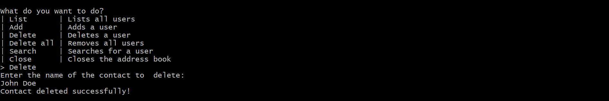
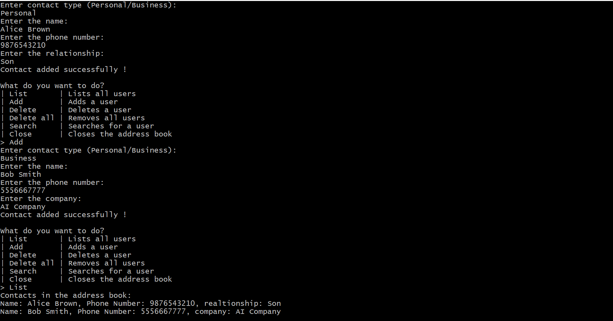

# 📖 Address Book Project

Welcome to the **Address Book** project! 🎉 This project is a simple C++ application that allows users to manage contacts efficiently. The project is fully documented using **Doxygen** 📚, making it easy to understand and maintain.

---

## ✨ Features

✅ Add a new contact 👤
✅ Search for a contact 🔍
✅ Delete a contact ❌
✅ Display all contacts 📜
✅ Save contacts to a file 💾
✅ Load contacts from a file 📂

---

## 🚀 Getting Started

### 🔧 Compilation
To compile the project, use the following commands:
```sh
 g++ Addressbook.cpp -c Addressbook.o
 g++ main.cpp -c main.o
 g++ Addressbook.o main.o -o addressbook.exe
```

### ▶️ Running the Application
```sh
 ./addressbook.exe
```

---

## 📜 Usage

### 1️⃣ Adding a Contact
```
Enter contact type (Personal/Business): Personal
Enter the Name: John Doe
Enter Phone Number: 1234567890
Enter the relationship: Brother
Contact added successfully! ✅
```
🖼️ **Screenshot:**


### 2️⃣ Searching for a Contact
```
Enter the name of contact to search:John Doe
Name: John Doe, Phone Number: 1234567890, realtionship: Brother
```
🖼️ **Screenshot:**


### 3️⃣ Deleting a Contact
```
Enter the name of the contact to  delete: John Doe
Contact deleted successfully! ❌
```
🖼️ **Screenshot:**



### 4️⃣ Displaying All Contacts
```
Contacts in the address book:
Name: Alice Brown, Phone Number: 9876543210, realtionship: Son
Name: Bob Smith, Phone Number: 5556667777, company: AI Company
```
🖼️ **Screenshot:**



---

## 📖 Documentation with Doxygen

This project is fully documented using **Doxygen**! 🎯

### 🛠️ Steps to Generate Documentation:
1. Install **Doxygen** if not already installed.
   ```sh
   sudo apt install doxygen   # For Linux
   winget install doxygen     # For Windows
   ```
2. Run Doxygen to generate documentation:
   ```sh
   doxygen -g  # Generate default Doxyfile
   doxygen Doxyfile
   ```
3. Open `html/index.html` in your browser to view the documentation. 🌐

---

## 📌 Conclusion
This **Address Book** project provides a simple yet powerful way to manage contacts in C++. The project is well-structured, documented with **Doxygen**, and serves as a great example of file handling, searching, and data manipulation in C++. 🚀
