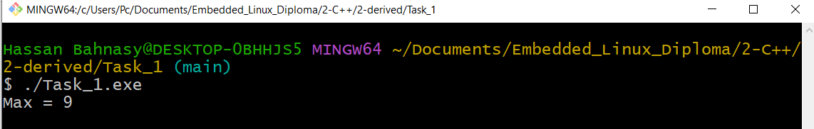
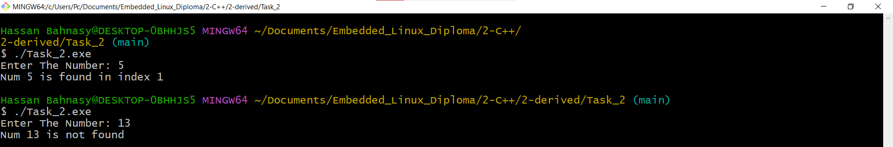
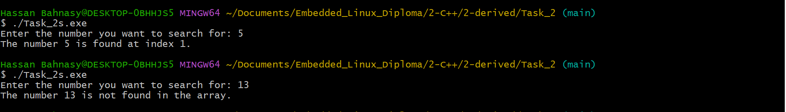
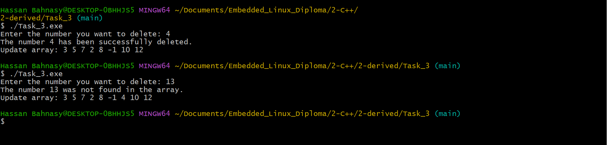
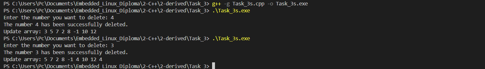
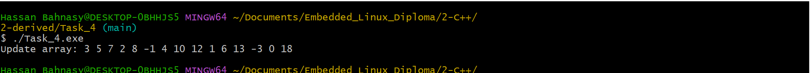
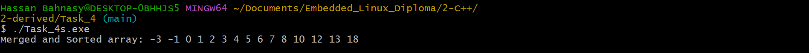
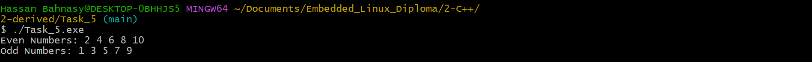
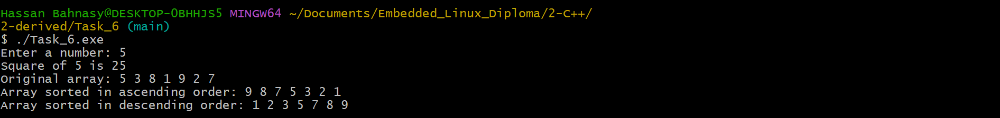

#  Derived Tasks 

  

## Overview 🌟

Welcome to the **C++ Derived Tasks**! 🎯 These tasks will help you get started with fundamental C++ concepts while practicing problem-solving skills. Each task includes two implementations to compare different approaches. 🧐

The **Address Book** project is a simple C++ console application that allows users to manage their contacts efficiently. It supports **personal** and **business** contacts, enabling users to **add, delete, search, and list** contacts dynamically. The project follows **OOP principles** with a base `Contact` class and derived classes for different contact types. The `AddressBook` class manages contacts using **smart pointers (`std::shared_ptr`)** for safe memory handling. The user interacts with the system through a **menu-driven interface**, making contact management intuitive and seamless. 🚀

## 📌 Task List

1️⃣ **Find Maximum in Array** 🔍
   - [`Task_1.cpp`](#task-1cpp) - Basic implementation
   - [`Task_1s.cpp`](#task-1scpp) - Template-based implementation with error handling

2️⃣ **Search for a Number in Array** 🔎
   - [`Task_2.cpp`](#task-2cpp) - Simple search function
   - [`Task_2s.cpp`](#task-2scpp) - Improved version with better readability

3️⃣ **Delete a Number from Array** 🗑️
   - [`Task_3.cpp`](#task-3cpp) - Deletes the first occurrence
   - [`Task_3s.cpp`](#task-3scpp) - Deletes all occurrences

4️⃣ **Merge Two Arrays** 🔄
   - [`Task_4.cpp`](#task-4cpp) - Simple merging
   - [`Task_4s.cpp`](#task-4scpp) - Merging with sorting

5️⃣ **Find Even and Odd Numbers** ⚖️
   - [`Task_5.cpp`](#task-5cpp) - Separates even and odd numbers

6️⃣ **Lambda Functions & Sorting** ⚡
   - [`Task_6.cpp`](#task-6cpp) - Uses lambdas for square calculation and sorting

---

## 📝 Task Details

### 1️⃣ Find Maximum in Array 🔍
#### `Task_1.cpp`
- Basic function to find the maximum number in an integer array.
- Uses a simple loop to compare values.

#### `Task_1s.cpp`
- Uses **templates** to support multiple data types.
- Implements **exception handling** to handle empty arrays.

🖼️ **Expected Output:** 

---

### 2️⃣ Search for a Number in Array 🔎
#### `Task_2.cpp`
- Simple function that iterates over the array to find the given number.

#### `Task_2s.cpp`
- Uses a **const reference** for efficiency.
- Improves readability and consistency.

🖼️ **Expected Output:** 

---

### 3️⃣ Delete a Number from Array 🗑️
#### `Task_3.cpp`
- Deletes the **first occurrence** of a number in an array.

#### `Task_3s.cpp`
- Deletes **all occurrences** of the number.

🖼️ **Expected Output:** 

---

### 4️⃣ Merge Two Arrays 🔄
#### `Task_4.cpp`
- Merges two arrays without sorting.

#### `Task_4s.cpp`
- Merges and sorts the result.

🖼️ **Expected Output:** 

---

### 5️⃣ Find Even and Odd Numbers ⚖️
#### `Task_5.cpp`
- Separates numbers into even and odd lists.

🖼️ **Expected Output:** 

---

### 6️⃣ Lambda Functions & Sorting ⚡
#### `Task_6.cpp`
- Demonstrates **lambda functions** for:
  - Calculating squares.
  - Sorting in ascending & descending order.

🖼️ **Expected Output:** 

---

### **Address Book Project** 🗂️

The **Address Book** project is a C++ console application for managing contacts.

🔗 [Read more about this project here](Address_Book/README.md)

---

## Author 👤

**Hassan Ahmed Fathy, El Bahnasy**  
- [LinkedIn](https://www.linkedin.com/in/hassanbahnasy/)  
- [GitHub](https://github.com/Bahnasy2001)  
- Contact: hassanbahnasy872@gmail.com